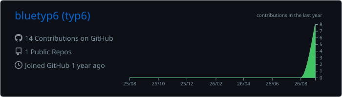
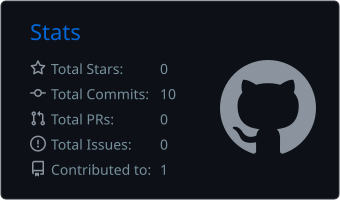
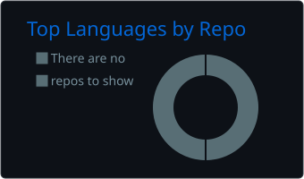
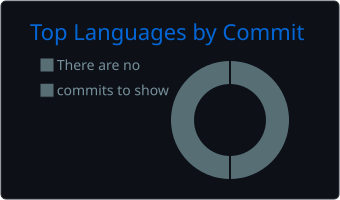

  

  building <strong>WarrTrack</strong> — offline-first warranty tracking&nbsp;·&nbsp;🔒 private beta 
  ex game-cheat dev — fortnite · valorant · cod → white hat

---

  
  

  
  

  

<picture>
  <source media="(prefers-color-scheme: dark)" srcset="https://raw.githubusercontent.com/bluetyp6/bluetyp6/output/github-contribution-grid-snake-dark.svg" />
  
</picture>
