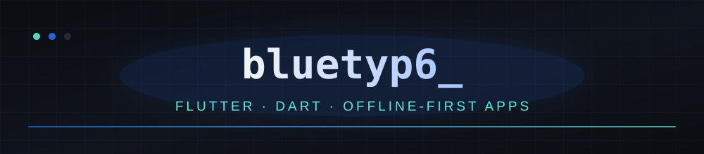
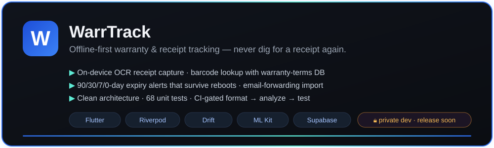

  

  

 

  
  
  

 

## 🔨 currently building

  

> Offline-first **warranty & receipt tracking** — scan or forward a receipt once,
> and never dig through drawers for it when something breaks.
> 🔒 in private development — **public release soon**.

 

## ⚙️ stack

  

 

## 📊 github

  
  

  

 

  
  

